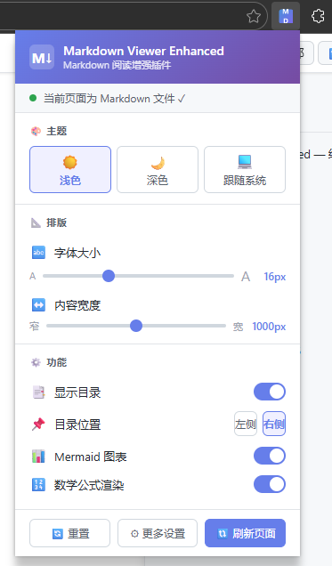
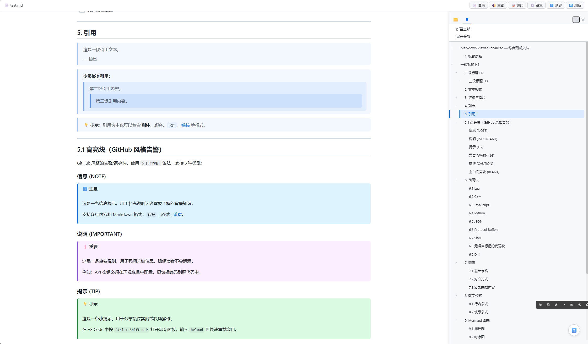
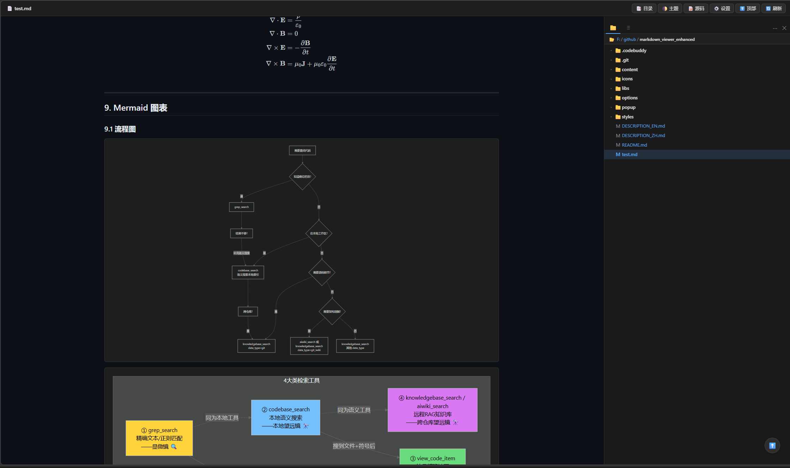

# Markdown Viewer Enhanced

<p>
  
  
  
</p>

> 🌐 [English](#english) | 🇨🇳 [中文](#中文)

---

<a id="english"></a>

## English

A browser extension that elegantly renders Markdown files with a file browser sidebar, Mermaid diagrams, syntax highlighting, KaTeX math formulas, table of contents navigation, multiple themes, and more.

### ✨ Key Features

- 📁 **File Browser** — Local file directory tree, folder expand/collapse, open files in new tab, breadcrumb navigation
- 🎨 **Multiple Themes** — Light / Dark / Auto (follows system), 15 code highlight themes (including auto)
- 📊 **Mermaid Diagrams** — Flowcharts, sequence diagrams, Gantt charts with click-to-zoom, drag & pan, keyboard shortcuts
- 💻 **Syntax Highlighting** — Powered by highlight.js, 180+ languages, line numbers, one-click copy, diff syntax highlighting
- 🔢 **KaTeX Math** — Inline `$...$` and block `$$...$$` LaTeX formula rendering with placeholder protection
- 📑 **TOC Navigation** — Auto-generated heading tree with fold/expand, left/right sidebar, scroll tracking, URL hash navigation
- 📐 **Typography** — Font size, line height, content width, font family customization, sidebar drag-to-resize
- 🖼️ **Image Enhancement** — Click-to-zoom, lazy loading
- 📝 **Extended Syntax** — GitHub alerts (including `[!BLANK]`), task lists, footnotes, definition lists, enhanced tables
- ⚙️ **Settings System** — Popup quick panel + Options advanced page, real-time push to all tabs

### 📋 Supported File Formats

| Extension | Description |
|-----------|-------------|
| `.md` | Markdown file |
| `.mdc` | Markdown component file |
| `.markdown` | Markdown file |
| `.mkd` | Markdown file |
| `.mdown` | Markdown file |
| `.mdtxt` | Markdown text file |
| `.mdtext` | Markdown text file |

Local `file://` supports all extensions above; remote `http://` / `https://` currently support `.md`, `.mdc`, and `.markdown`.

### 🚀 Getting Started

#### Install via Developer Mode (Recommended)

1. **Download the source code**: Clone or download this repository
   ```bash
   git clone https://github.com/LetitiaChan/markdown_viewer_enhanced.git
   ```
2. **Open the extensions page**:
   - Chrome: Navigate to `chrome://extensions/`
   - Edge: Navigate to `edge://extensions/`
3. **Enable Developer Mode**: Toggle the "Developer mode" switch in the top-right corner
4. **Load the extension**: Click "Load unpacked" and select the project folder (the directory containing `manifest.json`)
5. **Enable file access**: Click "Details" on the extension card → Enable "Allow access to file URLs"
6. **Start using**: Open any `.md` file in your browser, and the extension renders it automatically

> 💡 **Tip**: After modifying the code, go back to the extensions page and click the 🔄 refresh button on the extension card to apply updates.

#### Install from Web Store

1. **Install** the extension from the Web Store
2. **Open** any `.md` / `.mdc` file in your browser
3. **Auto Render** — the extension detects and renders Markdown automatically
4. **Customize** — click the extension icon to adjust themes, fonts, and more

#### Accessing Local Files

To render local Markdown files, enable file access for the extension:

1. Go to your browser's extension management page
2. Find **Markdown Viewer Enhanced**
3. Click "Details" → Enable "Allow access to file URLs"

### 🛠️ Tech Stack

| Module | Technology |
|--------|-----------|
| Markdown Parsing | [Marked.js](https://github.com/markedjs/marked) |
| Diagram Rendering | [Mermaid](https://github.com/mermaid-js/mermaid) |
| Syntax Highlighting | [highlight.js](https://github.com/highlightjs/highlight.js) |
| Math Formulas | [KaTeX](https://github.com/KaTeX/KaTeX) |
| Footnotes | [marked-footnote](https://github.com/bent10/marked-extensions) |
| HTML Sanitization | [DOMPurify](https://github.com/cure53/DOMPurify) |
| Platform | Browser Extension Manifest V3 |

### 🔒 Privacy

- **Does NOT** collect any user data
- **Does NOT** send information to external servers (except KaTeX font CDN)
- All settings stored locally in the browser (`storage.sync`)
- Required permissions: `activeTab`, `storage`, `tabs`, `scripting` (for local file browser feature)

---

<a id="中文"></a>

## 中文

一款浏览器扩展，在浏览器中优雅地渲染 Markdown 文件，支持文件浏览器侧边栏、Mermaid 图表、代码高亮、KaTeX 数学公式、目录导航、多主题切换等功能。

### ✨ 功能亮点

- 📁 **文件浏览器** — 本地文件目录树，文件夹展开/折叠，文件在新标签页打开，面包屑导航
- 🎨 **多主题切换** — 浅色 / 深色 / 跟随系统，15 种代码高亮主题（含 auto）
- 📊 **Mermaid 图表** — 流程图、时序图、甘特图等，支持点击放大、缩放、拖拽、键盘快捷键
- 💻 **代码高亮** — 基于 highlight.js，180+ 语言，行号显示，一键复制，diff 语法高亮
- 🔢 **KaTeX 数学公式** — 行内 `$...$` 和块级 `$$...$$` LaTeX 公式渲染，占位符保护机制
- 📑 **目录导航** — 自动生成目录树，支持折叠/展开子项，左/右侧边栏，滚动高亮追踪，URL hash 定位
- 📐 **排版设置** — 字体大小、行高、内容宽度、字体族自由调节，侧边栏拖拽调整宽度
- 🖼️ **图片增强** — 点击放大预览、懒加载
- 📝 **扩展语法** — GitHub 告警块（含 `[!BLANK]`）、任务列表、脚注、定义列表、增强表格
- ⚙️ **设置系统** — Popup 快捷面板 + Options 高级设置，实时推送到所有标签页

### 📋 支持的文件格式

| 扩展名 | 说明 |
|--------|------|
| `.md` | Markdown 文件 |
| `.mdc` | Markdown 组件文件 |
| `.markdown` | Markdown 文件 |
| `.mkd` | Markdown 文件 |
| `.mdown` | Markdown 文件 |
| `.mdtxt` | Markdown 文本文件 |
| `.mdtext` | Markdown 文本文件 |

本地 `file://` 支持以上全部扩展名；远程 `http://` / `https://` 当前支持 `.md`、`.mdc`、`.markdown`。

### 🚀 快速开始

#### 通过开发者模式安装（推荐）

1. **下载源码**：克隆或下载本仓库到本地
   ```bash
   git clone https://github.com/LetitiaChan/markdown_viewer_enhanced.git
   ```
2. **打开扩展管理页面**：
   - Chrome：地址栏输入 `chrome://extensions/`
   - Edge：地址栏输入 `edge://extensions/`
3. **开启开发者模式**：打开页面右上角的「开发者模式」开关
4. **加载扩展**：点击「加载已解压的扩展程序」按钮，选择项目文件夹（包含 `manifest.json` 的目录）
5. **开启文件访问**：在扩展卡片上点击「详情」→ 开启「允许访问文件网址」
6. **开始使用**：在浏览器中直接打开任意 `.md` 文件，插件自动渲染

> 💡 **提示**：每次修改代码后，回到扩展管理页面点击扩展卡片上的 🔄 刷新按钮即可更新。

#### 从插件市场安装

1. **安装插件**：从浏览器插件市场安装
2. **打开文件**：在浏览器中直接打开 `.md` / `.mdc` 文件
3. **自动渲染**：插件自动检测并渲染 Markdown 内容
4. **自定义设置**：点击扩展图标调整主题、字体等偏好

#### 访问本地文件

渲染本地文件需要开启插件的文件访问权限：

1. 进入浏览器扩展管理页面
2. 找到 **Markdown Viewer Enhanced**
3. 点击「详情」→ 开启「允许访问文件网址」

### 🛠️ 技术栈

| 模块 | 技术 |
|------|------|
| Markdown 解析 | [Marked.js](https://github.com/markedjs/marked) |
| 图表渲染 | [Mermaid](https://github.com/mermaid-js/mermaid) |
| 代码高亮 | [highlight.js](https://github.com/highlightjs/highlight.js) |
| 数学公式 | [KaTeX](https://github.com/KaTeX/KaTeX) |
| 脚注扩展 | [marked-footnote](https://github.com/bent10/marked-extensions) |
| 安全过滤 | [DOMPurify](https://github.com/cure53/DOMPurify) |
| 平台 | Browser Extension Manifest V3 |

### 🔒 隐私声明

- **不会**收集任何用户数据
- **不会**向外部服务器发送信息（KaTeX 字体 CDN 加载除外）
- 所有设置仅存储在浏览器本地（`storage.sync`）
- 所需权限：`activeTab`、`storage`、`tabs`、`scripting`（用于本地文件浏览器功能）

---

## 📬 Feedback & Support

- 🐛 [GitHub Issues](https://github.com/LetitiaChan/markdown_viewer_enhanced/issues)

---

## 📄 License

MIT License

---

**Markdown Viewer Enhanced** — 让 Markdown 阅读更优雅 ✨
