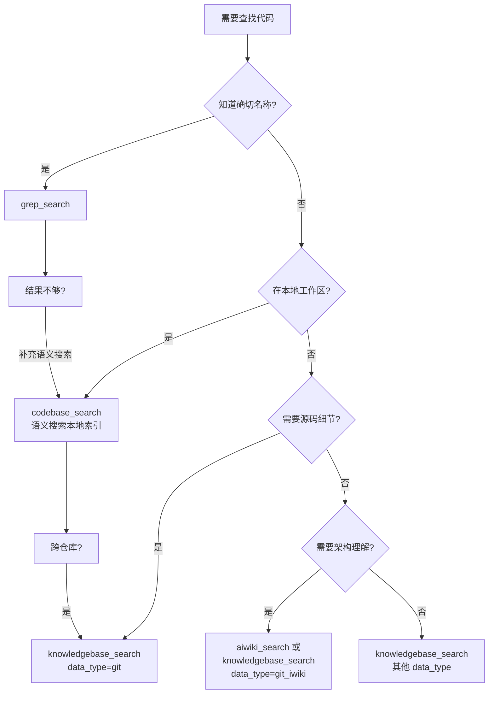
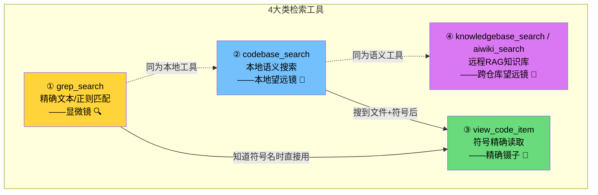
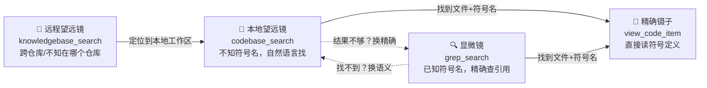
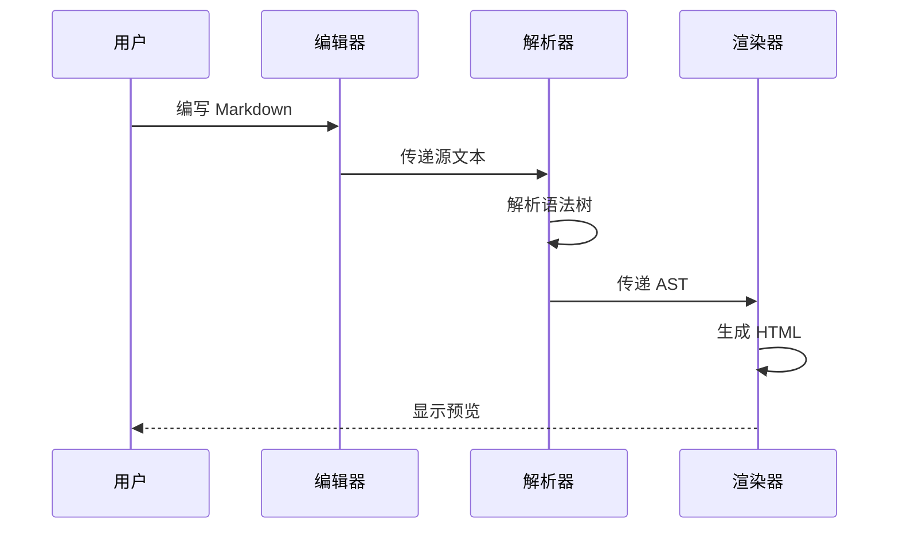
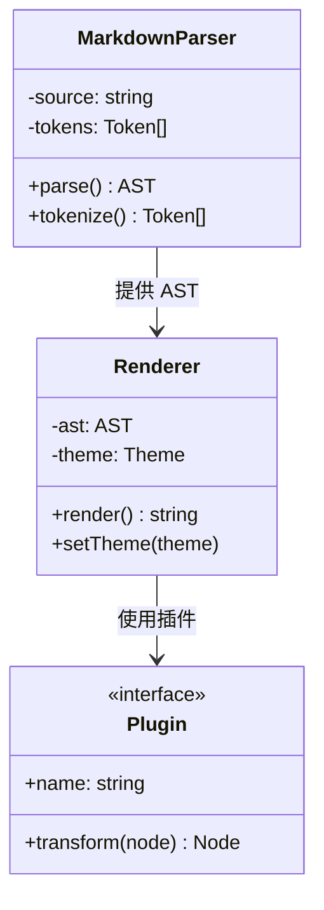
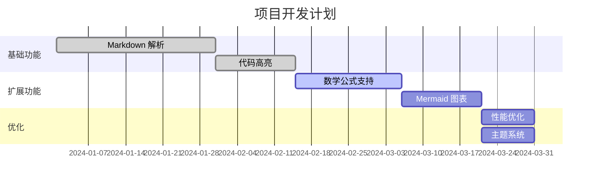
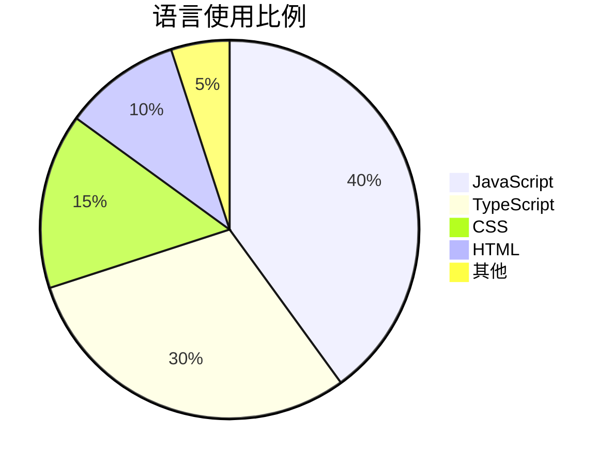

# Markdown Viewer Enhanced — 综合测试文档

> 本文件用于测试 Markdown Viewer Enhanced 的各项渲染能力，覆盖常见 Markdown 语法及扩展特性。

---

## 1. 标题层级

# 一级标题 H1
## 二级标题 H2
### 三级标题 H3
#### 四级标题 H4
##### 五级标题 H5
###### 六级标题 H6

---

## 2. 文本格式

这是一段**粗体文本**，这是一段*斜体文本*，这是***粗斜体文本***。

这是一段~~删除线文本~~。

这是一段 `行内代码` 示例。

这是一段<u>下划线文本</u>（HTML 标签方式）。

这是一段<mark>高亮文本</mark>。

上标示例：X<sup>2</sup> + Y<sup>2</sup> = Z<sup>2</sup>

下标示例：H<sub>2</sub>O 是水的化学式。

---

## 3. 链接与图片

### 3.1 链接

- 行内链接：[GitHub](https://github.com)
- 带标题的链接：[Google](https://google.com "谷歌搜索")
- 自动链接：<https://github.com>
- 引用式链接：[Markdown 指南][md-guide]

[md-guide]: https://www.markdownguide.org "Markdown Guide"


### 3.2 图片


带链接的图片：

[](https://github.com)

---

## 4. 列表

### 4.1 无序列表

- 苹果
- 香蕉
  - 小香蕉
  - 大香蕉
- 橙子
  - 脐橙
    - 赣南脐橙
    - 秭归脐橙

### 4.2 有序列表

1. 第一步：安装依赖
2. 第二步：配置环境
3. 第三步：启动项目
   1. 开发模式
   2. 生产模式

### 4.3 任务列表

- [x] 完成基础渲染
- [x] 支持代码高亮
- [x] 支持数学公式
- [x] 支持 Mermaid 图表
- [x] 支持暗色主题

---

## 5. 引用

> 这是一段引用文本。
> 
> — 鲁迅

> **多级嵌套引用：**
> 
> > 第二级引用内容。
> > 
> > > 第三级引用内容。

> 💡 **提示**：引用块中也可以包含 **粗体**、*斜体*、`代码`、[链接](https://example.com) 等格式。

---

## 5.1 高亮块（GitHub 风格告警）

GitHub 风格的告警/高亮块，使用 `> [!TYPE]` 语法；当前实现支持 5 种标准类型外加 1 种扩展空白块（`BLANK`）：

### 信息 (NOTE)

> [!NOTE]
> 这是一条**信息**提示。用于补充说明读者需要了解的背景知识。
> 
> 支持多行内容和 Markdown 格式：`代码`、*斜体*、[链接](https://example.com)。

### 说明 (IMPORTANT)

> [!IMPORTANT]
> 这是一条**重要说明**。用于强调关键信息，确保读者不会遗漏。
> 
> 例如：API 密钥必须在环境变量中配置，切勿硬编码到源代码中。

### 提示 (TIP)

> [!TIP]
> 这是一条**小提示**。用于分享最佳实践或快捷操作。
> 
> 在 VS Code 中按 `Ctrl + Shift + P` 打开命令面板，输入 `Reload` 可快速重载窗口。

### 警告 (WARNING)

> [!WARNING]
> 这是一条**警告信息**。用于提醒可能导致问题的操作。
> 
> 直接修改 `node_modules` 中的文件不会被版本控制跟踪，下次 `npm install` 后修改将丢失。

### 错误 (CAUTION)

> [!CAUTION]
> 这是一条**危险警告**。用于标识可能造成数据丢失或不可逆操作。
> 
> 执行 `git reset --hard` 将**永久丢弃**所有未提交的更改，此操作不可撤销！

### 空白高亮块 (BLANK)

> [!BLANK]
> 这是一个**无类型高亮块**，使用中性的灰色样式。
> 
> 适用于不需要特定语义、仅需视觉区分的引用内容。

---

## 6. 代码块


### 6.1 Lua

```lua
--- @module WeatherManager
--- @description 天气管理器

local WeatherManager = Class('WeatherManager')

function WeatherManager:ctor()
    self.currentWeather = nil
    self.weatherEffects = {}
end

return WeatherManager
```

### 6.2 C++

```cpp
#include <iostream>
#include <vector>
#include <algorithm>
#include <functional>

// 观察者模式 - 事件系统
template<typename... Args>
class EventDelegate {
public:
    using FuncType = std::function<void(Args...)>;

    void Bind(FuncType func) {
        listeners_.push_back(std::move(func));
    }

    void Broadcast(Args... args) const {
        for (const auto& listener : listeners_) {
            listener(std::forward<Args>(args)...);
        }
    }

    void Clear() { listeners_.clear(); }

private:
    std::vector<FuncType> listeners_;
};
```

### 6.3 JavaScript

```javascript
// 防抖函数
function debounce(fn, delay = 300) {
  let timer = null;
  return function (...args) {
    clearTimeout(timer);
    timer = setTimeout(() => {
      fn.apply(this, args);
    }, delay);
  };
}

// 使用示例
const handleSearch = debounce((query) => {
  console.log('搜索:', query);
}, 500);
```

### 6.4 Python

```python
from typing import List, Optional

class TreeNode:
    """二叉树节点"""
    def __init__(self, val: int = 0, left=None, right=None):
        self.val = val
        self.left = left
        self.right = right

def inorder_traversal(root: Optional[TreeNode]) -> List[int]:
    """中序遍历二叉树"""
    if not root:
        return []
    return (
        inorder_traversal(root.left)
        + [root.val]
        + inorder_traversal(root.right)
    )
```

### 6.5 JSON

```json
{
  "name": "markdown-viewer-enhanced",
  "version": "1.0.0",
  "description": "增强型 Markdown 查看器",
  "features": ["代码高亮", "数学公式", "Mermaid 图表"],
  "config": {
    "theme": "auto",
    "fontSize": 16,
    "lineNumbers": true
  }
}
```

### 6.6 Protocol Buffers

```proto
syntax = "proto3";

package game.projectt;

option go_package = "projectt/pb";

// 道具定义
message Item {
  uint32 item_id = 1;
  int32 count = 2;
  int64 expire_time = 3;
  map<string, string> extra_attrs = 4;
}
```

### 6.7 Shell

```bash
#!/bin/bash
# 批量重命名文件
for file in *.txt; do
    new_name="${file%.txt}.md"
    mv "$file" "$new_name"
    echo "已重命名: $file -> $new_name"
done
```

### 6.8 无语言标记的代码块

```
这是一段没有指定语言的代码块。
纯文本内容，不会进行语法高亮。
    保留缩进和空格。
```

### 6.9 Diff

```diff
- const oldFunction = () => {
-   console.log("旧版本");
- };
+ const newFunction = () => {
+   console.log("新版本");
+   return true;
+ };
```

---

## 7. 表格

### 7.1 基础表格

| 功能 | 状态 | 优先级 |
|------|------|--------|
| 标题渲染 | ✅ 已完成 | 高 |
| 代码高亮 | ✅ 已完成 | 高 |
| 数学公式 | ✅ 已完成 | 中 |
| Mermaid | ✅ 已完成 | 低 |

### 7.2 对齐方式

| 左对齐 | 居中对齐 | 右对齐 |
|:-------|:--------:|-------:|
| 左 | 中 | 右 |
| Apple | Banana | Cherry |
| 100 | 200 | 300 |

### 7.3 复杂表格内容

| 工具                     | 归类     | 是否 RAG        | 是否依赖 Index | 输入         | 搜索范围     | 典型场景        |
| ---------------------- | ------ | ------------- | ---------- | ---------- | -------- | ----------- |
| `grep_search`          | 精确匹配   | ❌             | ❌（直接扫磁盘）   | 文本/正则      | 本地磁盘     | 已知符号名、编辑后验证 |
| `codebase_search`      | 本地语义   | ✅ 本地 Code-RAG | ✅ 本地 Index | 自然语言问题     | 本地已索引工作区 | 不知符号名、探索性搜索 |
| `view_code_item`       | 符号定位   | ⚠️ 半 RAG      | ✅ 本地 Index | 文件路径 + 符号名 | 单个文件     | 已知位置，精确读取定义 |
| `knowledgebase_search` | 远程 RAG | ✅ 远程 RAG      | ✅ 远程向量库    | 自然语言 + 关键词 | 远程多仓库    | 跨仓库、架构理解    |
---

## 8. 数学公式

### 8.1 行内公式

质能方程：$E = mc^2$

圆的面积：$A = \pi r^2$，其中 $r$ 为半径。

求根公式：$x = \frac{-b \pm \sqrt{b^2 - 4ac}}{2a}$

### 8.2 块级公式

**欧拉恒等式：**

$$
e^{i\pi} + 1 = 0
$$

**高斯积分：**

$$
\int_{-\infty}^{+\infty} e^{-x^2} \, dx = \sqrt{\pi}
$$

**泰勒展开：**

$$
f(x) = \sum_{n=0}^{\infty} \frac{f^{(n)}(a)}{n!}(x-a)^n
$$

**矩阵运算：**

$$
A = \begin{pmatrix}
a_{11} & a_{12} & a_{13} \\
a_{21} & a_{22} & a_{23} \\
a_{31} & a_{32} & a_{33}
\end{pmatrix}
$$

**正态分布：**

$$
f(x) = \frac{1}{\sigma\sqrt{2\pi}} \exp\left(-\frac{(x-\mu)^2}{2\sigma^2}\right)
$$

**麦克斯韦方程组：**

$$
\begin{aligned}
\nabla \cdot \mathbf{E} &= \frac{\rho}{\varepsilon_0} \\
\nabla \cdot \mathbf{B} &= 0 \\
\nabla \times \mathbf{E} &= -\frac{\partial \mathbf{B}}{\partial t} \\
\nabla \times \mathbf{B} &= \mu_0 \mathbf{J} + \mu_0 \varepsilon_0 \frac{\partial \mathbf{E}}{\partial t}
\end{aligned}
$$

---

## 9. Mermaid 图表

### 9.1 流程图






### 9.2 时序图



### 9.3 类图



### 9.4 甘特图



### 9.5 饼图



---

## 10. 脚注

这是一段包含脚注的文本[^1]。Markdown 是由 John Gruber 创建的[^2]。

[^1]: 脚注内容会显示在页面底部。
[^2]: John Gruber 于 2004 年创建了 Markdown 语言。

---

## 11. 定义列表

Markdown
:   一种轻量级标记语言，用于格式化纯文本文档。

HTML
:   超文本标记语言，用于创建网页。

CSS
:   层叠样式表，用于描述 HTML 文档的外观和格式。

---

## 12. 分隔线

以下是三种分隔线写法：

---

***

___

---

## 13. HTML 内嵌

<details>
<summary>点击展开/折叠内容</summary>

这是折叠内容区域。

- 支持 Markdown 语法
- **粗体** 和 *斜体*
- `代码` 等

```javascript
console.log("折叠区域中的代码块");
```

</details>

<details>
<summary>颜色标记示例</summary>

<span style="color: red;">红色文字</span> | <span style="color: green;">绿色文字</span> | <span style="color: blue;">蓝色文字</span>

</details>

---

## 14. Emoji 表情

🎉 恭喜完成！ 🚀 发射升空！ 🐛 修复 Bug！ ✨ 新功能！ 📝 文档更新！

常用 Emoji 速查：
| 图标 | 含义 | 图标 | 含义 |
|:----:|------|:----:|------|
| ✅ | 完成 | ❌ | 失败 |
| ⚠️ | 警告 | 💡 | 提示 |
| 🔥 | 热门 | 🐛 | Bug |
| 🚀 | 发布 | 📦 | 打包 |

---

## 15. 长文本段落测试

Lorem ipsum dolor sit amet, consectetur adipiscing elit. Sed do eiusmod tempor incididunt ut labore et dolore magna aliqua. Ut enim ad minim veniam, quis nostrud exercitation ullamco laboris nisi ut aliquip ex ea commodo consequat. Duis aute irure dolor in reprehenderit in voluptate velit esse cillum dolore eu fugiat nulla pariatur. Excepteur sint occaecat cupidatat non proident, sunt in culpa qui officia deserunt mollit anim id est laborum.

中文长段落：《论语·学而》子曰："学而时习之，不亦说乎？有朋自远方来，不亦乐乎？人不知而不愠，不亦君子乎？"有子曰："其为人也孝弟，而好犯上者，鲜矣；不好犯上，而好作乱者，未之有也。君子务本，本立而道生。孝弟也者，其为仁之本与！"

---

## 16. 特殊字符与转义

反斜杠转义：\* \_ \# \[ \] \( \) \` \~

HTML 实体：&amp; &lt; &gt; &quot; &apos; &copy; &reg; &trade;

特殊符号：← → ↑ ↓ ↔ ⇐ ⇒ ± × ÷ ≠ ≤ ≥ ∞ ° © ® ™

---

## 17. 内部锚点、重复标题与导航

- [跳转到锚点测试目标](#锚点测试目标)
- [跳转到第一个“重复标题”](#重复标题)
- 裸链接测试：https://example.com/docs/markdown?from=viewer&lang=zh-CN
- 邮件自动链接：<dev@example.com>

### 锚点测试目标

如果点击上面的链接可以正确跳转到这里，说明标题锚点、别名锚点和内部导航基本正常。

### 重复标题

这是第一个同名标题，用于测试目录与标题 ID 去重。

### 重复标题

这是第二个同名标题，用于测试同名标题是否仍能正常渲染并出现在目录中。

Setext 一级标题示例
==================

Setext 二级标题示例
------------------

---

## 18. 换行、空行、注释与转义边界

这是同一段中的第一行
这一行前面没有空行，理论上应与上一行属于同一段落。

这是硬换行测试的第一行。  
这一行应该紧跟在上一行后面并发生换行。

这是使用 `<br>` 的换行测试。<br>
这一行应该显示在下一行。

可见文本（上）
<!-- 这是一段 HTML 注释，正常渲染时不应直接显示 -->
可见文本（下）

---

## 19. 列表、引用、任务与代码混排

1. 主任务一
   - [x] 已完成子任务，包含 **粗体**、`行内代码` 与 [链接](https://example.com)
   - [ ] 未完成子任务，包含 Emoji：🚧
   - 子任务中的引用：

     > 这是列表中的引用块。
     >
     > > 这是引用中的嵌套引用。

   - 子任务中的代码块：

     ```js
     const config = {
       price: '$100',
       enabled: true,
     };
     ```

2. 主任务二
   1. 有序子项 1
   2. 有序子项 2
      - 再嵌套一层无序列表
      - 再嵌套一层任务项
        - [x] 最内层任务

---

## 20. 数学公式边界用例

- 货币金额不应被误判为公式：$100、$2999、\$88
- 行内公式仍应正常渲染：$a^2 + b^2 = c^2$
- 代码中的美元符号不应触发公式：`const amount = '$100';`
- 错误公式应尽量以错误样式展示，而不是影响整页：

$ \frac{1}{ $

$$
x^2 + y^2 = z^2
$$

---

## 21. 代码围栏变体与特殊内容

### 21.1 使用波浪线围栏

~~~ts
type User = {
  id: number;
  name: string;
};
~~~

### 21.2 四反引号包裹三反引号
